# 从越狱到插件发布
* 什么是越狱？
    普通的iPhone只能是以mobile的权限运作，越狱可以获得更高一层root权限，可以操作访问的内容更多。
* 越狱可以干嘛？
    可以做的东西太多了，微信自动抢红包，免费下载收听付费音乐，隐藏不必要的广告时间等等，太多了
* 怎么越狱呢？
    目前市面上手机iOS（9.0-13.3.1）系统基本上都可以被越狱。那么我推荐的越狱工具有“爱思助手”， “Electra”，“Doubleh3lix”， “Chimera”， “CheckRa1n”， “unc0ver”等等，系统不一样，使用的工具不一样，详情[点击](https://www.abcydia.com/read-category/jailbreak)
    ## 第一步，越狱
    作者的使用的是iPad Air2（iOS13.3.1），越狱工具（仅支持Mac电脑）[CheckRa1n](https://checkra.in/)
    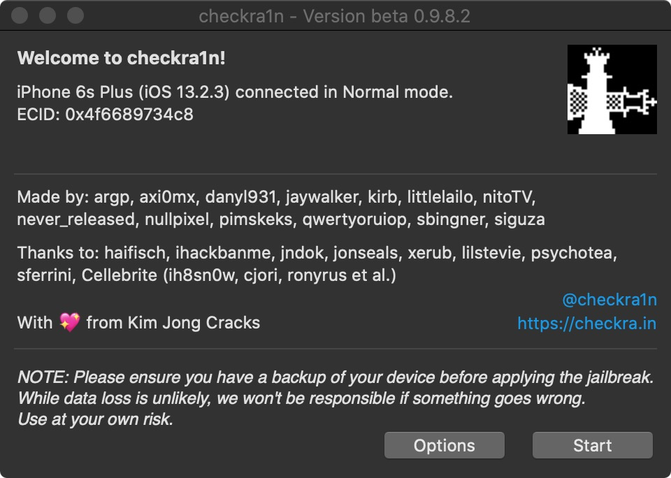
    
    iPad插入电脑，点击开始按照提示就能完成越狱
    
    
    
    iPad上多了一个checkra1n的APP，点击
    
    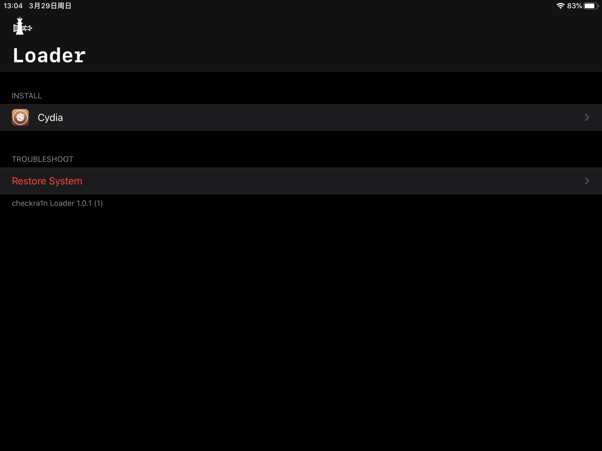
    
    安装Cydia,时间会比较长，安装成功表示越狱成功
    ## 使用别人的插件
    首先需要添加别人的源，这里我比较喜欢[小麻瓜](http://apt.margua.top)的源
    添加之后可以安装自己需要的工具，比方说AntiRevoke(无视证书失效，理论上可以安装无数个未授信的APP)
    ## 砸壳，逆向，分析代码
    我们需要知道，插件这个东西干了什么？其实就是修改别人APP的功能，what？是的，修改别人APP的功能，那么怎么做呢？
    一般分析APP需要脱壳，也叫砸壳，从App Store下载的软件都是加壳的，需要我们手动砸壳，网上很多砸壳教程，我就啰嗦了，但是比较推荐[frida](https://github.com/AloneMonkey/frida-ios-dump)
    砸壳成功后我们可以使用[MonkeyDev](https://github.com/AloneMonkey/MonkeyDev)工具在xcode上安装被砸壳的应用，这里作者使用了nplayer(播放视频)
    具体步骤，安装monkeyDev之后,Xcode新建工程，选择monkeyApp
    
    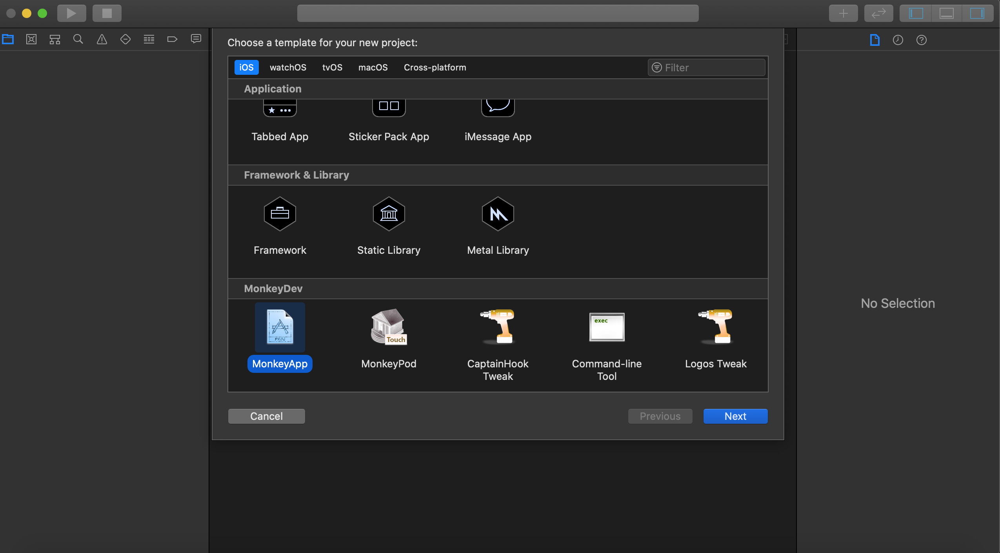
    
    打卡我们的工程，在左边可以看到比较重要的目录，一个是TargetApp（将我们要分析的APP放在该目录下）， 另一个是logos（这里面的.xm文件是我们用来分析第三方软件的代码处）
    
    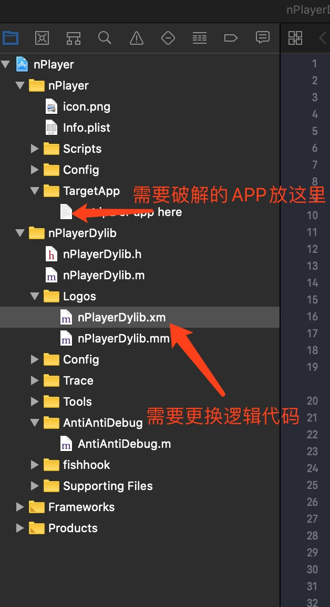
    
    * 那么问题来了，我怎么去分析别人的代码呢？
        接下来就介绍今天的杀器[IDA](https://www.hex-rays.com/products/ida/),网上有各种破解的，需要的小伙伴自己去Google
        
        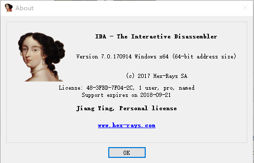
        
        把我们要分析的可执行文件拖拽到ida分析器中
        
        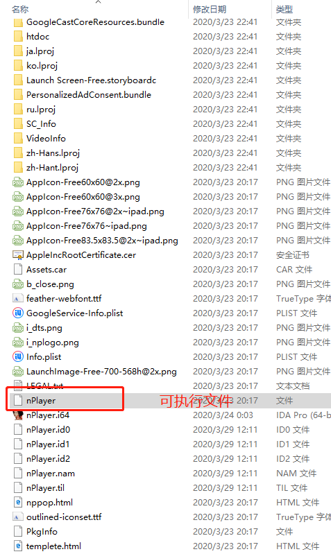
        
        主要分析界面
        
        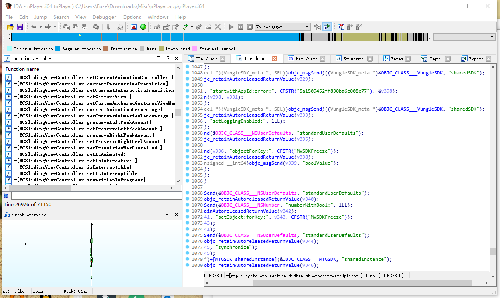
        
        为什么我要搞这个APP呢？因为有广告，嘻嘻
        我们发现使用monkey分析这个APP就闪退，为啥呢？
        下面，我们就到IDA分析工具里去看看是因为啥
        一般我们会想着去APPdelegate 这个方法里找
        
        `
            - (BOOL)application:(UIApplication *)application didFinishLaunchingWithOptions:(NSDictionary *)launchOptions
        `
        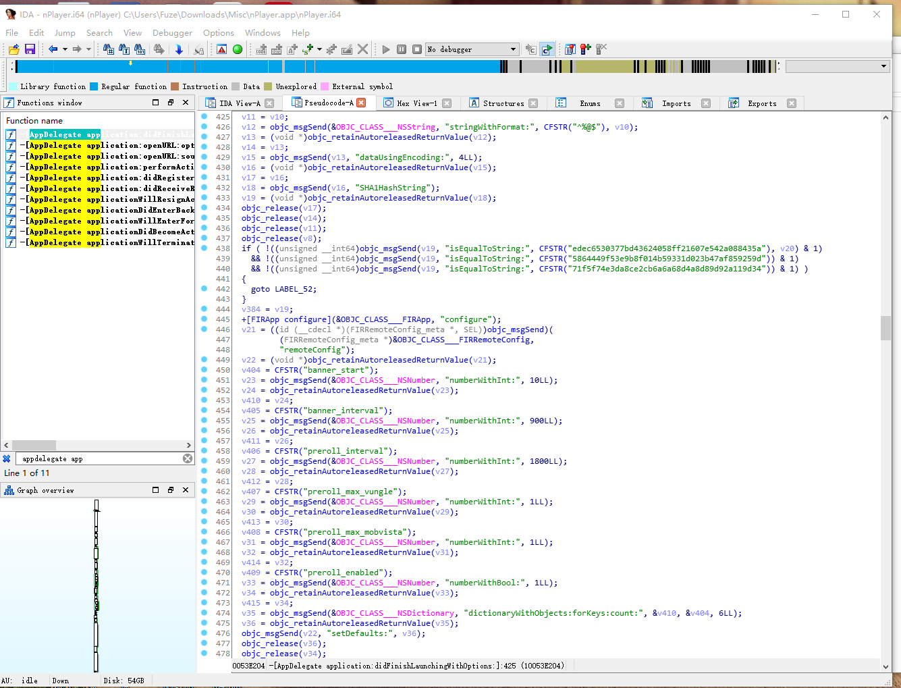
        
        如果你的界面跟我的不一样，那么请切换到伪代码模式，快捷键F5,在伪代码里我们可以看到，程序去判断bundleid的hash值是否满足这个几个值
        
        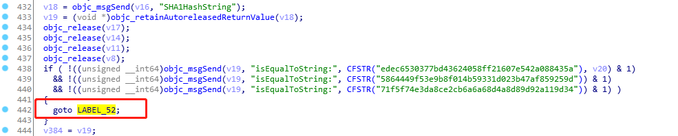
        
        如果不满足就调整到 LABEL_52中，这里我么是可以双击跳转的
        
        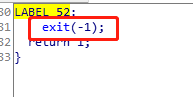
        
        仔细看看，这不就exit了，哈哈哈，既然问题找到了，那么我们去hook返回值，返回任何一个他满足的就了
        
        `
            %hook NSData
                - (id)SHA1HashString {
                    return @"edec6530377bd43624058ff21607e542a088435a";
                %end
        `
        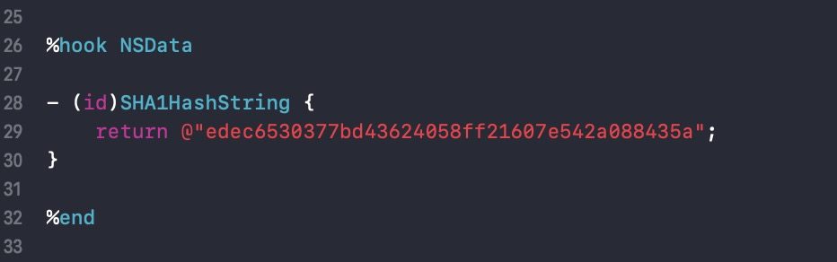
        
        一个简单的破解搞定，其余的ad方法，我上传到GitHub，有兴趣的小伙自己去玩
        
        ## 插件发布，也是我今天要讲的，网上资源很少
        
        使用`nic.pl`命令，这个是安装monkeydev的时候帮你装好了的,按照自己的信息往下填就好了
        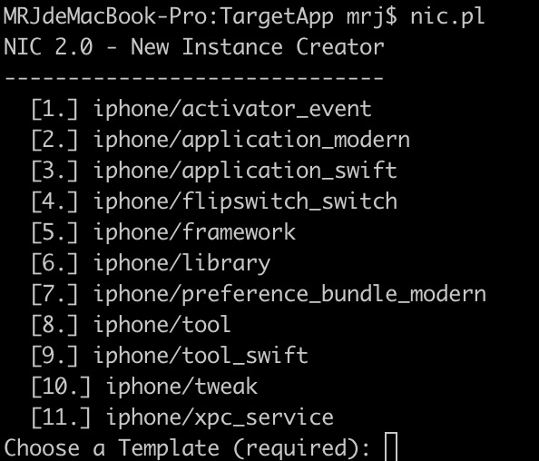
        
        完成以后会出现以下control、Makefile、nplayer1.plist、Tweak.x
        * control
        
        
        `
            Package: npplayer1 // 包名
            
            Name: nplayer1 // 插件名称
            
            Depends: mobilesubstrate // 依赖的库
            
            Version: 0.0.1 // 版本号
            
            Architecture: iphoneos-arm // 框架
            
            Description: MRJ HOOK! // 插件说明
            
            Maintainer: MRJ // 维护者
            
            Author: MRJ // 作者
            
            Section: Tweaks // 区域
        `
        * Makefile
    
    
        `
        
            INSTALL_TARGET_PROCESSES = SpringBoard // 安装目标
            
            include $(THEOS)/makefiles/common.mk // 打包需要文件
            
            TWEAK_NAME = nplayer1 // 插件名
            
            nplayer1_FILES = Tweak.x // 就是我们分析别人的代码
            
            nplayer1_CFLAGS = -fobjc-arc
            
            include $(THEOS_MAKE_PATH)/tweak.mk
        `
        
        * nplayer1.plist
        Bundles 里面放着我们需要hook别人的包名，这是一个数组
        * Tweak.x
        我们之前写的代码
        
        
        `
        
            %hook NSData
            
            - (id)SHA1HashString {
                
                return @"edec6530377bd43624058ff21607e542a088435a";
            }
            %end
            
            %hook AdConfig
            
            + (id)sharedConfig {
                return nil;
            }

            %end
        `
#### 接下来就是打包

终端下打开该目录的，
* 执行`make` 
* 如果没问题执行打包 `make package`, 
* 会在该目录下出现`packages`,
* 打开该目录会出现`npplayer1_0.0.1-5+debug_iphoneos-arm.deb` 
* 执行`dpkg-scanpackages npplayer1_0.0.1-5+debug_iphoneos-arm.deb > Packages`
* 会出现`Packages`这个文件，这里会有一个坑
* `Filename: ./npplayer1_0.0.1-5+debug_iphoneos-arm.deb` 绝对路径改成相对路径，不然Cydia安装包的时候会出爱心URL错误
* 执行`bzip2 Packages`,会生成`Packages.bz2`文件
* 手动创建`Release`文件

`
    Origin: 大鱼 软件源™ // Cydia中会显示你的插件源名称
    
    Label: EchosDaddy
    
    Suite: stable
    
    Version: 0.01
    
    Codename: EchosDaddy
    
    Architectures: iphoneos-arm
    
    Components: main
    
    Description: mrj
`

### 最后一步
将这3个文件放入到你服务器webserver中，作者本人使用Nginx搭建了本地服务

`
        server {
            listen       9999;
            server_name  localhost;
    
            location / {
                root   /Users/mrj/Documents/www/;
                index  index.html index.htm;
            }
        }
`

打开已经Cydia，添加越狱源`http://192.168.31.190:999`
可以看到我们的源已经搞定

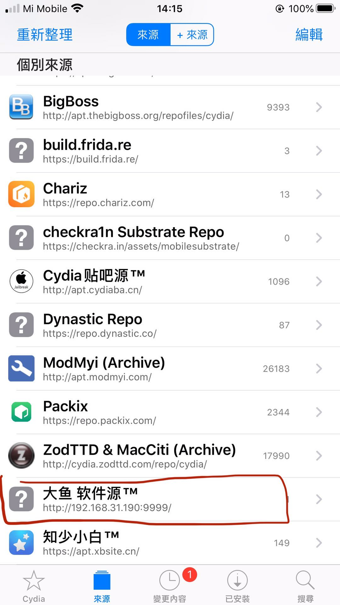

看到了我们的插件，安装一下试试

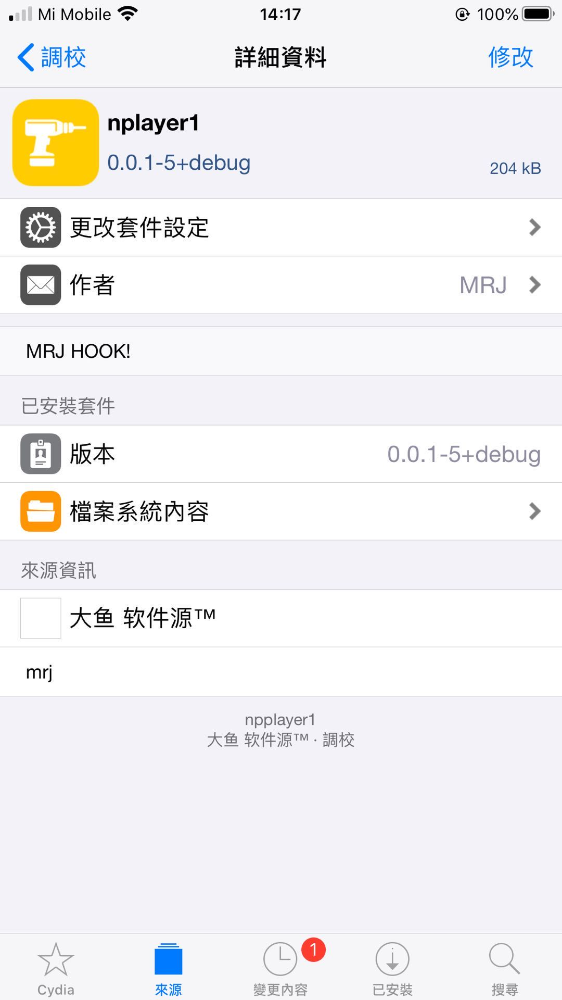

怎么样，nplay的广告木有了

